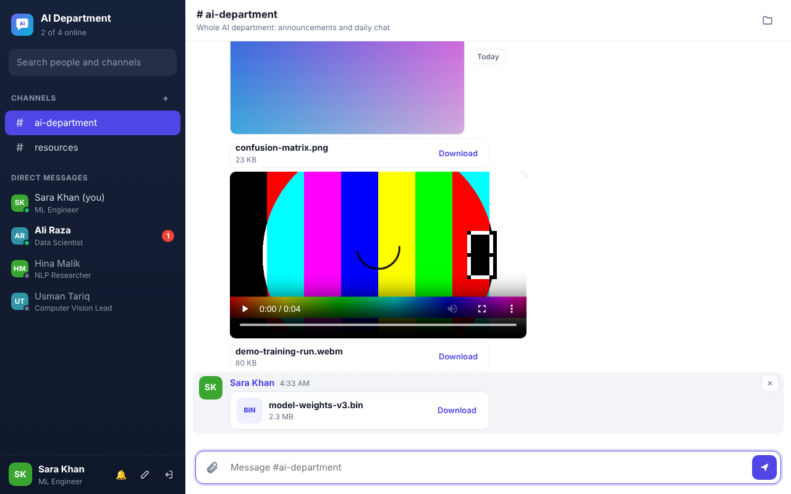

# AI Department Office Chat

A private messenger for the **AI department** that runs on the **office network (LAN)**.
Everyone opens it in their browser. Nothing needs to be installed on their computers,
and no internet connection is required.

> **Roman Urdu khulasa:** Yeh office ke network par chalne wali chat app hai. Ek computer
> par server chalayein (`start-windows.bat`), baqi sab colleagues apne browser mein us
> computer ka address kholein (jaise `http://192.168.1.20:8080`). Group chat, private
> chat, aur files / images / videos bhejna sab is mein hai. Internet ki zaroorat nahi.



## Features

- **Channels** for group chat. Starts with `#ai-department` and `#resources`; anyone can add more, e.g. `#computer-vision`.
- **Direct messages**: private one-to-one chats, plus your own "(you)" notes.
- **File transfer**: send any file (datasets, model weights, PDFs, zip files). The default limit is **2 GB per file**.
- **Images** show inline and open full-screen when clicked. **Videos** and **audio** play right in the chat, with seeking.
- Add files with the 📎 button, by **dragging and dropping**, or by **pasting** a screenshot (Ctrl+V).
- Upload progress bar with cancel.
- **Online status** (green dot), "last seen", and "… is typing" indicator.
- **Unread badges**, a sound alert, and the unread count in the browser tab title.
- **Shared files panel** (folder icon) that lists every file in a conversation.
- Delete your own messages and files.
- Works on desktop and phones (on the office Wi-Fi), with automatic dark mode.
- Chat history is saved on the server and survives restarts.

## Setup (10 minutes)

Pick **one** computer to be the server. It should stay on during office hours.
A PC that is always on, or a small office server, works best.

### 1. Install Node.js on the server computer

Download the **LTS** version from <https://nodejs.org> and install it with the default options.
You only need it on this one computer.

### 2. Copy this `office-chat` folder to that computer

For example to `C:\office-chat`.

### 3. (Recommended) Set a team passcode

Copy `config.example.json` to `config.json` and edit it:

```json
{
  "teamName": "AI Department",
  "passcode": "choose-a-secret",
  "port": 8080,
  "maxUploadMB": 2048
}
```

With a passcode set, only people who know it can create an account. This keeps other
departments on the same network out. Share it with your team in person.

### 4. Start the server

- **Windows:** double-click `start-windows.bat`
- **Linux / macOS:** run `./start.sh` (or `npm start`)

The window shows the address to share, for example:

```
  AI Department chat is running.

  On this computer:      http://localhost:8080
  Colleagues open:       http://192.168.1.20:8080
```

Keep this window open. Closing it stops the chat.

### 5. Allow it through the firewall (Windows)

The first time you start it, Windows asks whether to allow Node.js on networks.
Tick **Private networks** and click **Allow**. If you missed the prompt, run this once
in an **Administrator** PowerShell:

```powershell
New-NetFirewallRule -DisplayName "AI Dept Chat" -Direction Inbound -Protocol TCP -LocalPort 8080 -Action Allow -Profile Private,Domain
```

### 6. Everyone joins

Each colleague opens the address (e.g. `http://192.168.1.20:8080`) and bookmarks it.
The first time, they choose a **username** and **PIN** and add their name and role.
After that, they sign in with the same username and PIN.

**Tip:** ask IT to give the server computer a **fixed IP address**, or reserve one on
the router (DHCP reservation), so the address never changes.

## Settings

Settings go in `config.json` (or environment variables, which take priority):

| `config.json` | Environment variable | Default | Meaning |
|---|---|---|---|
| `teamName` | `TEAM_NAME` | `AI Department` | Name shown in the app |
| `passcode` | `TEAM_PASSCODE` | *(none)* | Needed to sign up or sign in |
| `port` | `PORT` | `8080` | Network port |
| `maxUploadMB` | `MAX_UPLOAD_MB` | `2048` | Largest file allowed, in MB |
| `dataDir` | `DATA_DIR` | `data` | Where history and files are stored |
| `tlsKey`, `tlsCert` | `TLS_KEY`, `TLS_CERT` | *(none)* | Paths to a certificate, to serve over HTTPS |
| `defaultChannels` | | `ai-department`, `resources` | Channels created on first start |

## Backups and storage

Everything lives in the `data/` folder next to `server.js`:

- `messages.jsonl`: all messages
- `uploads/`: all shared files
- `users.json`, `channels.json`, `sessions.json`

To back up, copy the `data/` folder. To move the chat to another computer, copy the whole
`office-chat` folder including `data/`. Make sure the server disk has room for the files
your team shares (videos and model weights add up quickly).

## Good to know

- **Forgot PIN:** stop the server, delete that person's entry from `data/users.json`, and start it again.
  They can then sign up again with the same username. Their old messages stay.
- **Desktop pop-up notifications** only work over HTTPS or on `localhost`, because browsers
  require it. On plain `http://` over the LAN you still get the sound alert,
  the unread badges and the count in the tab title. To get pop-ups as well, set `tlsKey`/`tlsCert`.
- **Video formats:** MP4 (H.264) and WebM play inside the chat in Chrome, Edge and Firefox.
  Other formats (e.g. `.mkv`, `.avi`) are still shared and can be downloaded with one click.
- **Security:** traffic is not encrypted unless you enable HTTPS. That is normal for an internal
  office tool, but do not expose this port to the internet. PINs are stored hashed (scrypt),
  private chats and their files are only visible to the two people in them, and wrong
  PIN attempts are rate-limited.

## How it works

- `server.js` is a single Node.js file with **no dependencies** (no `npm install` needed).
  It serves the web app, a small JSON API, and live updates over Server-Sent Events.
  Uploads are streamed to disk, so large videos do not use much memory.
- `public/` contains the web app (`index.html`, `app.js`, `styles.css`).
